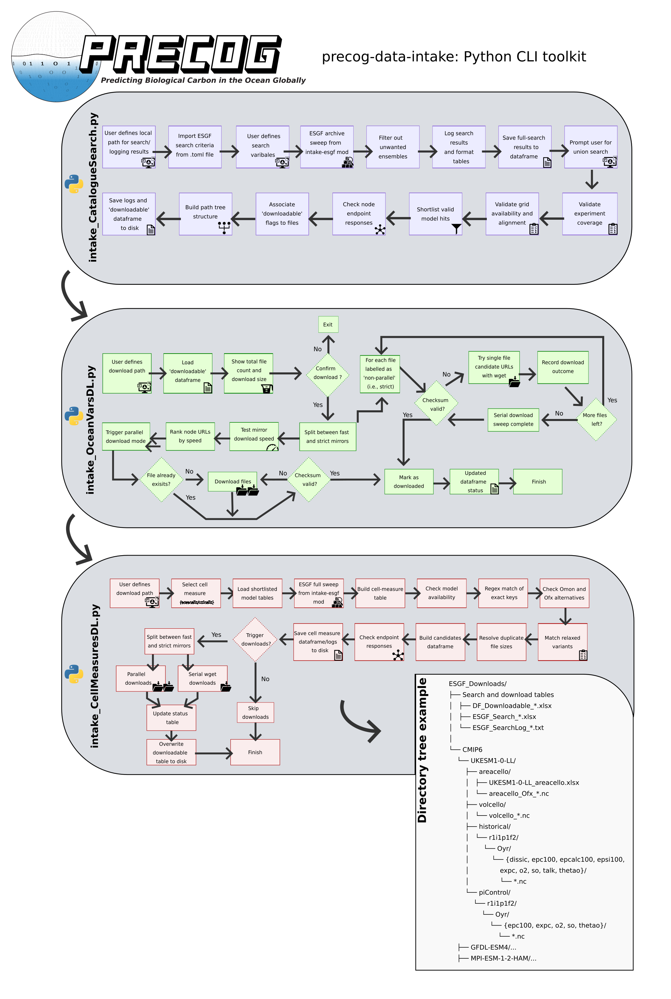

# Summary

`precog-esgf-intake` is a Python command-line-interface (CLI) software for automated discovery, checking,
validation, and download of Earth System Model outputs from Earth System Grid Federation (ESGF) archives. The
software is designed for research workflows that require reproducible access to large, distributed climate-model
datasets and is particularly aimed at bulk screening of Earth System archives before downstream analysis. The
software builds on inherited ESGF access functionality from `intake-esgf` [@Collier_intake_esgf_2026], while
introducing interactive CLI workflows for archive interrogation, file-availability checks, grid-consistency
cross-checks, temporal validation, export of search results in tabular formats, and optimised download management of
shortlisted Earth System Model data products.

# Statement of need

Modern Earth System science workflows frequently rely on climate-model data distributed across Earth System Grid
Federation [(ESGF)](https://esgf.github.io/index.html) nodes [@ESGFAggregation]. For example, a Coupled Model
Intercomparison Project (CMIP) analysis to constrain future projections in ocean carbon inventories requires
standardized output of ocean biogeochemical variables (carbon, oxygen, nutrients) across many models and
experiments[@Wilson2022].
These archived data are often distributed across many federated storage nodes, including duplicated,
incomplete or corrupted versions. Although ESGF provides a federated infrastructure for searching and accessing these
archives, practical research workflows often require additional automation to determine whether a given combination of
variables,
experiments, ensemble members, and grid configurations is both scientifically suitable and operationally downloadable
before substantial time is spent retrieving files.

This issue is especially important for CMIP-style analyses in which researchers may need to confirm that the same Earth
System Model provides paired pre-industrial, historical and ssp-scenario simulations, that multiple variables of
interest are available and whether these are separately
archived on compatible grids for downstream analyses; and that temporal coverage is continuous across archived files.
Manual inspection of catalogue search results can become slow, repetitive, and error-prone when screening many candidate
models or variables across multiple ESGF nodes.

Among its features, `precog-esgf-intake` provides an interactive workflow for shortlisting Earth System Model datasets
that satisfy compound criteria across experiments and variables. The software validates temporal coverage, grid
consistency, and file availability across published ESGF archives before download. Users can export search results as
tabular summaries, inspect and refine shortlisted datasets, and initiate batch downloads or trigger file integrity
checks on locally assigned output paths. Retrieved data are then organised into a directory structure suitable for
reproducible downstream analysis. This workflow is particularly useful when researchers need to screen many candidate
models and variables before selecting datasets that are both scientifically appropriate and operationally accessible
within their computational and storage constraints.

Furthermore, by automating the retrieval and validation of CMIP grid metrics like `volcello` , `areacello` as default
(and enabling further bespoke searches for `deptho` or `thkcello` as a validated substitutes when
`volcello` is unavailable) — `precog-esgf-intake` reduces the need for users to understand CMIP metadata and ESGF
directory conventions. By wrapping ESGF discovery in a simple Python CLI and allowing users to tailor searches by
editing a straightforward `search_criteria.toml` configuration file, the
package supports both accessible default workflows and more bespoke dataset selection. This lowers the barrier for
researchers
new to CMIP while enabling experienced users to specify models, experiments, variables, frequencies, and other search
constraints. Its lightweight design also supports terminal-based HPC workflows, allowing data discovery and ingestion
from visualisation nodes and Jupyter sessions rather than interactive web portals or manual downloads.

# State of the field

CMIP data are currently accessible through the ESGF metagrid web application, which provides web-based discovery and
download services for CMIP5, CMIP6, CMIP6Plus, and the upcoming CMIP7 phases. Recent development efforts have focused on
analysis-ready, cloud-optimised approaches based on in-memory object storage [@Mizielinski2026], with catalogue sweep
tools enabling more scalable access through Python and xarray, while community evaluation frameworks like
ESMValTool[@ESMValTool]
supporting integrated diagnostics for benchmarking model outputs.

`precog-esgf-intake` builds on the ESGF catalogue node sweeping implementation from `intake-esgf`
[@Collier_intake_esgf_2026], but targets a different level of the workflow: rather than focusing only on data access
primitives and caching data-responses to in-memory use, it provides an interactive command-line environment for ample
discovery, screening, validating and managing downloads of published ESGF archive products that satisfy scientific
constraints relevant to Earth system and ocean biogeochemistry applications. The software is intended for situations in
which researchers need to move efficiently from broad discovery and catalogue searches to a smaller, analysis-ready
subset of model output that satisfies practical and scientific constraints.

# Key functionality

The software provides several features tailored to archive-scale Earth system data workflows:

- Definition of ESGF search criteria by modifying a `search_criteria.toml` configuration file.
- automated ESGF node-based searches using project, activity, experiment, frequency, variable, and grid filters
  (inherited from `intake-esgf`);
- interactive user prompts for download paths and variable selections within CLI workflows;
- bulk screening of CMIP6 archive holdings for paired `piControl` and `historical` availability;
- validation of continuity in date stamps for CMIP6 pre-industrial and historical simulations;
- checks for consistent availability of model output across compatible grids such as `gn` and `gr`;
- conditional multi-variable screening for models that satisfy compound search criteria, including cases where several
  required variables must be available simultaneously;
- export of tabular ESGF catalogue search results for easy inspection, search snapshot logging, and reproducible
  shortlist generation;
- parallel URL pre-checks with verification of server responses and flagging of shortlisted outputs as downloadable,
- download manager with parallel transfers that select responsive ESGF node locations and include retry or integrity
  checks for corrupted files
- in cases where the same file is available across many nodes, the fastest download option is prioritised based on the
  user's connection
- retrieval of ocean grid-cell measure variables such as `areacello` and `volcello` for selected models, together
  with saved ESGF archive snapshots for later inspection.

# Software design and workflow overview

`precog-esgf-intake` implements a staged workflow for archive-scale ESGF data discovery and retrieval. Rather than
moving directly from catalogue search to cached download, the software separates archive interrogation, shortlist
generation, downloadability checks, and file retrieval into distinct command-line steps, allowing users to inspect and
validate intermediate results before proceeding. In a typical workflow (Figure 1), the user first specifies a parent
download directory and one or more target variables. The workflow supports a user-editable
`search_criteria.toml` file that can predefine ESGF search facets, including project, experiments, frequency, variables,
and grid labels, while still allowing interactive entry of variable_id when that field is intentionally left blank.
The catalogue search stage then queries ESGF holdings for matching CMIP products (CMIP6 as the default option), filters
results to retain scientifically relevant combinations such as
paired `piControl` and `historical` simulations, and exports tabular search summaries for inspection. Subsequent stages
verify whether shortlisted files are reachable on remote nodes, assign local destination paths, and download both target variables and required supporting grid-cell
measures such as `areacello` and `volcello`. This staged design is intended to improve transparency and reproducibility in archive-based Earth system workflows. By
treating search results, validation outputs, and downloadable file lists as explicit intermediate artifacts, the
software supports both interactive use and later auditing of dataset selection decisions.

{width=90%}
*Figure 1. precog-esgf-intake toolkit overview and directory structure of an example ESGF download. The top-level
directory
contains search outputs and model-specific CMIP6 data organised by model, experiment, variable, and annual files.*

# Research impact and applications

A representative use case is the identification of CMIP6 models that simultaneously provide both pre-industrial
and historical outputs for ocean biogeochemical variables such as `expc` and `epc100`, together with auxiliary or
supporting variables and the associated grid-cell measures required for downstream analyses. The repository
accompanying this software includes
a [workflow example](https://github.com/LeoBertini/precog-esgf-intake/blob/main/Workflow_Example_POCflux.ipynb)
demonstrating this type of archive screening and retrieval process.

This is particularly relevant for ocean biogeochemistry and carbon-cycle studies, where analyses often
depend on coherent combinations of physical and biogeochemical fields rather than isolated variables (e.g., retrieval of
carbonate system fields as well as ocean state physical variables, [@Wilson2022]). In such cases, the time spent
screening archive holdings, checking consistency, and organising downloads can be substantial, and purpose-built
automation improves both efficiency and reproducibility. This data discovery and retrieval functionality by
`precog-esgf-intake` is also complementary to established CMIP preprocessing packages such as xMIP [@xMIP] and
ESMValTool [@ESMValTool] , which provide tools for harmonising,
cataloguing, and preparing model outputs for analysis; together, these packages support a reproducible workflow from
archive discovery and dataset selection
through to preprocessing and scientific analysis

Therefore, `precog-esgf-intake` fills a workflow gap between catalogue access and scientific analysis. The software
capabilities support workflows in which data access is itself a significant part of the scientific process,
particularly when analyses depend on assembling coherent, scientifically consistent, and analysis-ready
ensemble subsets of Earth system model output from distributed archives.

# AI usage disclosure

AI assistance was used solely to improve readability of selected software documentation (Claude Sonnet 5 by Anthropic).
No AI tools were used to design, implement, or validate the software. All AI-assisted documentation was reviewed and
edited by the authors, who retain full responsibility for its accuracy and content. Authors made all the core design and
architectural decisions.

# Acknowledgements

This work is part of the [PRECOG - Predicting Biological Carbon in the Ocean Globally](https://precog-ocean.github.io)
project, funded by UK Research and Innovation (UKRI) through a Future Leaders Fellowship Award (Project Reference
MR/Y016629/1). The authors thank the developers of `intake-esgf` and the wider ESGF infrastructure for making
climate-model archives programmatically accessible to the research community. `precog-esgf-intake` builds directly on
the core implementation by `intake-esgf`, and this dependency is gratefully acknowledged.

# References

